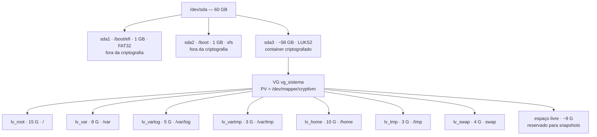

# Guia de Instalação — RHEL 9 com LVM sobre LUKS

Esse guia é pra reproduzir a instalação do RHEL 9 que a gente (Grupo 1) fez,
seguindo o esquema de disco que o professor pediu: tudo o que é LVM fica
dentro de um único container LUKS2, menos o `/boot` e o `/boot/efi`, que
ficam de fora. SELinux fica em `enforcing` desde o primeiro boot até o fim.

Instalamos usando o Anaconda (o instalador gráfico padrão do RHEL), no modo
Server sem GUI — nada de ambiente gráfico instalado, é só terminal.

## Sumário

1. [Pré-requisitos](#1-pré-requisitos)
2. [Diagrama do particionamento](#2-diagrama-do-particionamento)
3. [Criação da VM](#3-criação-da-vm)
4. [Instalação — passo a passo no Anaconda](#4-instalação--passo-a-passo-no-anaconda)
5. [Primeiro boot e validação](#5-primeiro-boot-e-validação)
6. [Opções de montagem restritivas (fstab)](#6-opções-de-montagem-restritivas-fstab)
7. [Adicionando o segundo disco (20 GB)](#7-adicionando-o-segundo-disco-20-gb)
8. [Evidências a coletar](#8-evidências-a-coletar)
9. [Troubleshooting](#9-troubleshooting)

---

## 1. Pré-requisitos

Antes de sair instalando qualquer coisa, separa isso aí:

- ISO do RHEL 9.x x86_64, baixada em developers.redhat.com (precisa criar
  conta, mas é de graça)
- Depois de baixar, roda `sha256sum rhel-9.x-x86_64-dvd.iso` e confere com o
  hash que a Red Hat publica na página de download. Se não bater, baixa de
  novo — não adianta seguir com uma ISO corrompida
- Hipervisor: VirtualBox, VMware, KVM/QEMU ou Proxmox, o que o grupo já usa
- Firmware **UEFI ligado**. Nada de BIOS legado
- Disco principal de 60 GB
- Um segundo disco de 20 GB — mas esse só entra depois, lá na seção 7
- 4 GB de RAM e 2 vCPUs
- Rede em NAT ou Host-Only. Bridge exposto pra rede real, nem pensar

Uma coisa que vale repetir: pensa numa passphrase forte pro LUKS e anota em
algum lugar seguro **antes** de começar. Não existe "esqueci a senha, recupera
pra mim" aqui — sem a passphrase (ou um backup do header do LUKS), o disco
inteiro vira lixo digital.

## 2. Diagrama do particionamento



Por que montamos assim:

Todo o volume group fica dentro do LUKS — um container só, uma passphrase só
no boot, e qualquer LV novo que a gente criar depois já nasce criptografado
de graça, sem precisar configurar nada extra.

O `/boot` fica de fora de propósito. Faz sentido quando você para pra pensar:
o GRUB tem que conseguir ler o kernel pra dar boot, e isso acontece **antes**
de qualquer chave de criptografia existir. Não tem como pedir senha pra abrir
uma coisa que ainda nem carregou. É o ponto fraco do esquema, e a gente sabe
disso — quem tiver acesso físico à máquina consegue mexer no /boot sem
passphrase nenhuma. Resolver isso direito precisaria de Secure Boot com
assinatura de kernel, só que aí sai do escopo do trabalho.

E deixamos uns 9 GB livres no VG sem alocar pra ninguém. Parece desperdício
mas não é: sem espaço livre não dá pra tirar snapshot de LV nem socorrer um
volume que encher no futuro. VG com 100% de uso não é eficiência, é um
problema esperando pra acontecer.

> **Checkpoint do D-14:** antes de ir pra próxima seção, esse diagrama
> precisa ser aprovado pelo professor. Ele foi bem claro que isso não é
> sugestão — corrigir no papel agora custa dez minutos, corrigir depois de
> instalado custa reinstalar tudo de novo.

## 3. Criação da VM

A gente usou VirtualBox, então os comandos abaixo são pro `VBoxManage`
(adapta pro hipervisor que o seu grupo estiver usando):

```bash
VBoxManage createvm --name "rhel9-grupo1" --ostype RedHat_64 --register
VBoxManage modifyvm "rhel9-grupo1" --cpus 2 --memory 4096 --firmware efi
VBoxManage modifyvm "rhel9-grupo1" --nic1 nat
VBoxManage createhd --filename "rhel9-grupo1-disk1.vdi" --size 61440
VBoxManage storagectl "rhel9-grupo1" --name "SATA" --add sata
VBoxManage storageattach "rhel9-grupo1" --storagectl "SATA" --port 0 --device 0 \
  --type hdd --medium "rhel9-grupo1-disk1.vdi"
VBoxManage storageattach "rhel9-grupo1" --storagectl "SATA" --port 1 --device 0 \
  --type dvddrive --medium "rhel-9.x-x86_64-dvd.iso"
```

Antes de ligar, dá uma olhada rápida se:

- [ ] O firmware tá em EFI (não BIOS)
- [ ] Só o disco de 60 GB está anexado — o segundo disco entra só lá na frente
- [ ] A rede tá em NAT ou Host-Only

## 4. Instalação — passo a passo no Anaconda

1. Dá boot pela ISO, chega na tela do Anaconda, clica em *Install Red Hat
   Enterprise Linux 9*.
2. Escolhe o idioma (a gente foi de português mesmo, mas fica a critério do
   grupo documentar em qual).
3. Na tela de **Installation Summary**:

   *(print reservado aqui: tela cheia do Installation Summary)*

   - Em **Software Selection**, marca **Minimal Install** (o mais enxuto) ou
     **Server** sem adicionar nenhum pacote gráfico. Qualquer um dos dois
     serve pro requisito de "sem GUI" do material.

     *(print reservado aqui: Software Selection com a opção marcada)*

   - Em **Installation Destination**, seleciona o disco de 60 GB e escolhe
     **Custom** — isso abre o particionamento manual.

4. Na tela de particionamento manual, cria nessa ordem:

   Primeiro o `/boot/efi`, com 1 GiB e sistema de arquivos **EFI System
   Partition** (o Anaconda formata como FAT32 sozinho, não precisa mexer).

   Depois o `/boot`, também 1 GiB, mas com xfs. Aqui **não marca** a caixa de
   Encrypt — lembra que ele fica de fora do LUKS por design.

   *(print reservado aqui: particionamento logo depois de criar boot/efi e boot)*

   Agora o resto do disco (uns 58 GiB que sobraram). Cria um mount point novo
   — pode ser o `/` mesmo — e na mesma tela marca Device Type como **LVM** e
   a caixinha de **Encrypt**. Nesse momento o Anaconda vai pedir a passphrase
   do LUKS. **Anota ela agora**, não deixa pra depois.

   Uma pegadinha aqui: o Anaconda cria o Volume Group com um nome qualquer
   por padrão (tipo `rhel`). Isso não fica do jeito que a gente quer
   sozinho — precisa clicar em **Modify...** do lado do Device Type (abre uma
   janela chamada "Configure Volume Group") e trocar o nome pra `vg_sistema`
   na mão, pra bater com o esquema que a gente desenhou.

   *(print reservado aqui: tela com LVM + Encrypt marcados — esse é o print mais importante do guia inteiro)*
   *(print reservado aqui: prompt pedindo a passphrase)*

   Com o VG certo, cria os outros Logical Volumes clicando no "+" — um pra
   cada ponto de montagem da tabela lá da seção 2: `/`, `/var`, `/var/log`,
   `/var/tmp`, `/home`, `/tmp` e o `swap`. Os ~9 GiB que sobram, deixa livre
   mesmo, não aloca pra nada.

   Depois de tudo criado, clica em Done. O Anaconda mostra um resumo de tudo
   que vai mudar — confere e clica em Accept Changes.

   *(print reservado aqui: resumo final antes de aceitar, com todos os LVs)*

5. Define a senha do root (essa senha só serve local mesmo, porque depois o
   SSH vai bloquear login de root — isso tá no guia do SSH do grupo).
6. Cria o usuário que vai ter sudo — é esse usuário que vai acessar via SSH
   depois, não o root.

   *(print reservado aqui: senha de root e criação do usuário)*

7. Confirma a rede e define o hostname (a gente usou `rhel9-grupo1.local`).
8. Confere tudo no resumo e clica em Begin Installation.
9. Quando terminar, clica em Reboot System. Só não esquece de tirar a ISO
   antes de reiniciar, senão ele boota nela de novo.

## 5. Primeiro boot e validação

No primeiro boot, antes até de aparecer a tela de login, o initramfs vai
pedir a passphrase do LUKS pra conseguir montar o disco. Isso é esperado,
não é bug.

*(print reservado aqui: o prompt pedindo a passphrase logo no boot, ainda no console)*

Depois que logar, roda esses comandos aí pra conferir se ficou tudo certo:

```bash
getenforce                 # tem que responder Enforcing
sestatus                   # confere se a policy é targeted e o modo é enforcing
cat /etc/os-release        # só pra ver a versão do RHEL mesmo
uname -r
lsblk -f                   # dá pra ver a árvore inteira: sda1/sda2/sda3 -> crypt -> LVs
sudo cryptsetup luksDump /dev/sda3
sudo pvs; sudo vgs; sudo lvs
findmnt -o TARGET,SOURCE,FSTYPE,OPTIONS
```

Se estiver tudo certo, **tira um snapshot da VM agora**. Essa instalação
limpa é o ponto que a gente quer poder voltar se alguma coisa der errado lá
na frente.

E não esquece: depois que o SSH estiver configurado e endurecido (ver o
script `ssh-audit-harden.sh` do grupo), **tira um segundo snapshot**. São os
dois momentos que o material pede pra salvar — antes disso não tem o que
salvar ainda, e depois seria tarde demais se algo quebrar.

## 6. Opções de montagem restritivas (fstab)

Antes de editar, faz um backup: `sudo cp /etc/fstab /etc/fstab.bak`. Depois
disso, adiciona essas opções nas linhas correspondentes:

| Ponto de montagem | Opções | O que isso trava |
|---|---|---|
| `/tmp`, `/var/tmp` | `nodev,nosuid,noexec` | Não deixa rodar um binário gravado ali dentro — esse é o jeito mais clássico de escalar privilégio |
| `/home` | `nodev,nosuid` | Impede um usuário comum criar um binário SUID dentro da própria pasta dele |
| `/var/log` | `nodev,nosuid,noexec` | Protege os logs de serem adulterados ou virarem esconderijo de payload |
| `/boot`, `/var` | `nodev` (e `nosuid` só no /boot) | Isola a área de boot e trava o crescimento estranho de dados de serviço |

Depois de mexer no fstab, testa sem reiniciar:

```bash
sudo mount -o remount /tmp
sudo mount -o remount /var/tmp
sudo mount -o remount /home
sudo mount -o remount /var/log
sudo mount -o remount /boot
sudo mount -o remount /var
findmnt -o TARGET,OPTIONS | grep -E 'tmp|home|log|boot|var'
```

Se algum desses remounts der erro, resolve ali mesmo. Nunca reinicia a
máquina com um fstab que não foi testado — corre o risco real da VM não subir
mais.

### E o `noexec` em `/var` vai dar problema, sim

Se o grupo instalar Podman ou qualquer coisa com container, o `noexec` no
`/var` quase certamente vai quebrar a execução das camadas de imagem que
ficam guardadas ali. E o mesmo `noexec` no `/var/tmp` pode travar alguma
atualização que precisa descompactar pacote naquele diretório.

Isso é esperado, não é erro do grupo. O que importa é documentar a decisão
que vocês tomarem: ou mantém o `noexec` e muda o storage dos containers pra
outro lugar, ou tira essa opção só ali no `/var` e explica o porquê. Só
copiar a tabela sem testar de verdade não vale — o exercício é justamente
achar esse tipo de atrito.

## 7. Adicionando o segundo disco (20 GB)

Isso só entra depois que a instalação e o SSH já estiverem funcionando, não
antes.

Primeiro, anexa o disco de 20 GB na VM. Depois, dá um `lsblk` pra achar o
nome do dispositivo novo (geralmente aparece como `/dev/sdb`).

Cria o Physical Volume e estende o Volume Group:

```bash
sudo pvcreate /dev/sdb
sudo vgextend vg_sistema /dev/sdb
sudo vgs        # só pra conferir que o VG cresceu
```

Escolhe um LV pra estender (a gente usou o `/home` como exemplo) e cresce o
sistema de arquivos com a máquina ligada, sem downtime:

```bash
sudo lvextend -L +15G /dev/vg_sistema/lv_home
sudo xfs_growfs /home
df -h /home
```

Guarda o antes e depois de `lvs`, `df -h` e `vgs` lá na pasta `evidencias/`
do repositório.

## 8. Evidências a coletar

O professor prefere saída de comando em texto do que print — dá pra conferir
de verdade. Roda tudo isso e joga o resultado na pasta `evidencias/`:

```bash
lsblk -f
sudo cryptsetup luksDump /dev/sda3
sudo pvs; sudo vgs; sudo lvs
findmnt -o TARGET,SOURCE,FSTYPE,OPTIONS
cat /etc/fstab
cat /etc/crypttab
cat /etc/os-release
uname -r
getenforce
sestatus
```

## 9. Troubleshooting

**Esqueci de marcar Encrypt antes de criar o VG.** Não rola converter depois
sem perder tudo. Só um jeito: volta pra tela de particionamento, apaga o
mount point que criou em cima do LVM e refaz desde o passo 4, marcando
Encrypt dessa vez.

**A passphrase não passa no boot, caiu num shell tipo `dracut:/#`.** Antes de
achar que esqueceu a senha, confere o layout de teclado — se digitou com
`br-abnt2` na instalação mas o boot tá em outro layout, alguns caracteres
mudam de lugar. Testa `loadkeys br-abnt2` e tenta de novo com `cryptsetup
luksOpen /dev/sda3 luks-teste`. Agora, se realmente for a senha errada e não
sobrou nenhum backup do header do LUKS, não tem mais o que fazer — os dados
foram, é assim que o esquema funciona por design.

**O `noexec` quebrou alguma coisa depois do remount.** Já é esperado, olha a
seção 6. Reverte a opção só naquele ponto de montagem específico e documenta
o motivo.

**O VG chegou em 100% de uso.** Provavelmente esqueceu de deixar o espaço
livre lá da seção 2. Dá pra reduzir algum LV com `lvreduce` (arriscado,
tira um snapshot antes de mexer) ou adianta a expansão do segundo disco da
seção 7.

**O GRUB não acha o kernel depois de mexer no `/boot`.** Como o `/boot` fica
fora do LUKS por escolha nossa, qualquer bagunça manual ali (tipo apagar um
initramfs sem querer) pode quebrar o boot sem ter nada a ver com a
criptografia em si. Mais rápido voltar pro snapshot da seção 5 do que ficar
tentando consertar na unha.

**SELinux voltou pra Permissive ou apareceu Disabled.** Confere o
`/etc/selinux/config` (`SELINUX=enforcing`) e roda `getenforce`. Se foi só um
`setenforce 0` que alguém deu sem querer, `sudo setenforce 1` já resolve na
hora. Mas o arquivo de config é o que garante que isso sobrevive a um reboot.
E vale lembrar: se o SELinux estiver desligado na hora da avaliação, são 10
pontos a menos direto.
